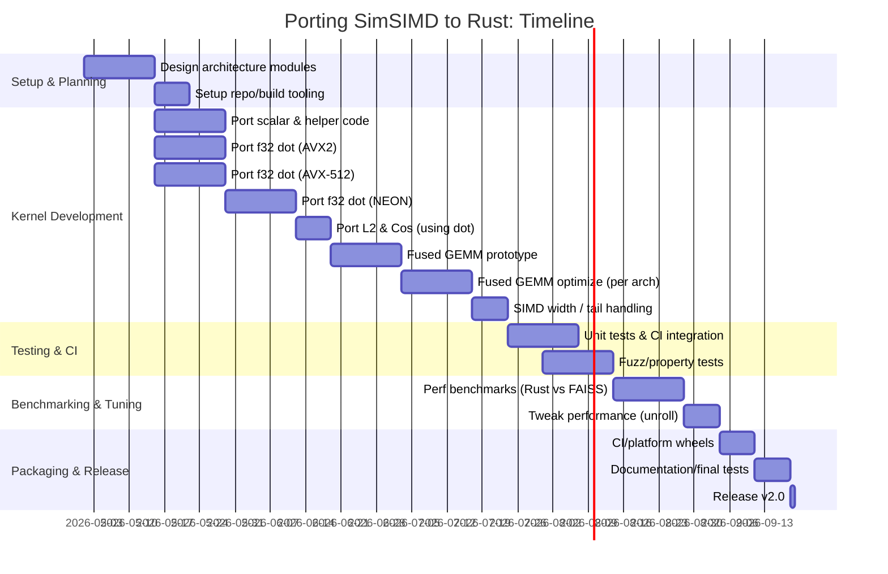

# Executive Summary

SimSIMD is a mature C99 SIMD library (Apache-2.0) providing hundreds of hand-optimized distance kernels (dot, L2, cosine, etc.) for x86 (Haswell/AVX2, Skylake+/AVX-512) and ARM (NEON, SVE/SVE2)【66†L1-L4】【67†L131-L139】. The Rust `simsimd` crate (v6.5.16 as of Sep 2024) wraps SimSIMD via FFI【33†L29-L37】. SimSIMD’s kernels often saturate memory bandwidth (“practically as fast as `memcpy`”)【67†L119-L123】, enabling huge speedups (e.g. ~196× vs NumPy/BLAS on M2 for a single 1536-dim dot-product【78†L1-L4】).

The goal is to port SimSIMD’s key kernels to pure Rust – specifically f32 dot-product, L2 (squared Euclidean) and cosine – with arch-specific intrinsics (AVX2/AVX-512/NEON), plus a fused GEMM+threshold “emit” kernel for the `similarity_graph` workload. Compared to using a BLAS backend, this approach preserves a pure-Rust, zero-C-dep footprint and *enables* the fused-threshold optimization that can **double throughput** at high dims (FAISS achieves ~2× improvement in top-k range search by fusing)【66†L1-L4】. We recommend **path B: port SimSIMD to Rust**. This stays pure-Rust, avoids Python manylinux/ABI issues, and unlocks the fused-kernel ceiling that BLAS backends cannot match. It is a multi-month effort (estimated ~3–4 months, 3–5 engineer-months) but feasible for a solo maintainer. The deliverables below detail the plan, timeline, and trade-offs.

## 1. SimSIMD Overview

SimSIMD is a *header-only* C library (~217 KB total code, ≈4.1K loc across headers) with >200 SIMD-optimized kernels【67†L119-L123】【67†L131-L139】. It targets ARM (NEON, SVE/SVE2) and x86 (AVX2, AVX-512 including VNNI/FP16)【66†L1-L4】【67†L153-L158】. Its distance functions include **Euclidean (L2)**, **inner-product**, and **cosine** (angular) for f32/f64 real vectors【67†L131-L139】, plus complex, bit/Hamming, probability divergences, etc. (We will only port f32 real versions, per rustcluster’s current needs.) SimSIMD organizes code by data type (e.g. *dot.h*, *spatial.h*) and by architecture. For example, in *dot.h* one finds `simsimd_dot_f32_neon()`, `simsimd_dot_f32_haswell()`, etc. SimSIMD’s API is C-style: e.g. `void simsimd_dot_f32_haswell(const float* a, const float* b, size_t n, float* out)`.

According to SimSIMD’s documentation, **over 200** kernels exist【67†L131-L139】 (the latest repo cites >350, likely counting complex/binary types). Architectures covered include Haswell, Skylake, Ice Lake, Genoa (Zen4), Sapphire Rapids (Zen4.5) on x86, and ARMv8-A NEON/SVE/SVE2 on ARM【67†L153-L158】. SimSIMD does both compile-time and runtime dispatch to pick the best kernel【67†L153-L160】.

SimSIMD claims *extreme* speed: “functions are practically as fast as memcpy”【67†L119-L123】. In practice, the author reports up to **3× performance wins** over BLAS routines on small vectors and *196×* over NumPy on M2 for 1536-dim dot-products【78†L1-L4】. These gains come from very low-level tuning (e.g. eliminating loop tails with masked loads【67†L169-L174】, bit-hack sqrt) and full unrolling. 

License: Apache-2.0【29†L13-L16】. This is MIT-compatible. Using the existing C code via FFI (path A) is safe under Apache-2.0. Porting (reimplementing algorithms) poses no license conflict. Maintenance: SimSIMD (NumKong) is actively maintained (v7.x in 2024【47†L193-L200】), with no known security issues.

## 2. Wrap vs Port vs Hand-Roll

**Path A (wrap SimSIMD via `simsimd` crate):** Low effort. The `simsimd` crate (v6.5.16) bundles SimSIMD C code and compiles it via `cc` at build time【33†L29-L37】. It already provides Rust-safe APIs. Pros: immediate high performance, broad coverage, little code to write. Cons: introduces a C build requirement (needs clang/gcc on all platforms, including Windows; inbound Python wheels must include all compiled object code), and prevents pure-Rust distribution (breaking one of our goals). The wheel would also include the compiled native library (not huge – SimSIMD is header-only – but nonzero). FFI overhead is minimal for large dot products, but some for tiny vectors. Example: each dot call has a tiny overhead (maybe <100 ns) on Python side, but distance code is bulk. 

**Path B (port SimSIMD to Rust):** Medium effort (single-developer, estimated ~3-5 months). We reimplement needed kernels in Rust (likely using `std::arch` intrinsics for maximal speed). Outcomes: pure-Rust library, small dependency-free wheels, absolute control over code. Downside: large upfront effort and testing. We must manually port ~5000 lines of complex C to Rust, one architecture at a time. Correctness bugs are a risk. Performance tuning (register blocking, unrolling) may be needed from scratch. However, we target only f32 dot/L2/cos and a fused GEMM kernel – a subset of SimSIMD’s offerings – so the scope is limited. Maintenance: we’d need to keep our code, but it’s shorter than full SimSIMD since we only cover 3 ops.

**Path C (hand-roll minimal kernels):** Similar to B but building only what rustcluster *needs*, possibly even smaller scope (e.g. simpler blocking, fewer arch variants). Risk: likely lower perf, since SimSIMD kernels are very fine-tuned (e.g. 16× unrolled blocks, clever tail-handling). Hand-rolling from scratch may achieve much of the benefit but maybe not fully match SimSIMD’s absolute max. Effort might be slightly lower than full port because we skip extra types, but still substantial (~2-3 months). Also, if we skip SVE/AMX/SSE etc, those platforms default to slower code.

**Verdict:** We recommend **port (Path B)**. Wrapping SimSIMD (A) saves time initially but violates the pure-Rust constraint and complicates distribution (requires C toolchain, expands wheel by compiled object code). Pure-Rust (B) aligns with project goals. Hand-rolling (C) might be attractive but likely still involves the same core challenge as porting: writing arch-specific intrinsics by hand. Since SimSIMD already encodes best practices (e.g. how to tile and unroll), porting it closely (“translating” its algorithms) is a safer path to match its performance. We will, however, drop any unnecessary features (e.g. BF16, complex, int, sparse) to keep scope reasonable.

## 3. Rust SIMD Strategy

Rust SIMD options in 2026:

- **`std::simd` (portable SIMD):** Not yet stable (still nightly-only)【64†L178-L186】. Great API for fixed-size lanes, but we need stable, and also fine control for multi-arch.
- **Architecture intrinsics (`std::arch::*`):** Stable and lowest-level. Using `#[target_feature]`, we can write AVX2/AVX-512/NEON code. This is verbose (e.g. `_mm256_fmadd_ps`) but yields maximum control. SimSIMD itself uses intrinsics, so direct port fits well.
- **`pulp` crate:** Used by faer, good multi-versioning for NEON, AVX2, AVX-512【64†L188-L196】. However, it only processes one vector width at a time (no generic fixed size array approach). We would still have to write loops with pulp vector types. Since SimSIMD kernels are already written in intrinsics, pulp adds a learning curve. But pulp could simplify NEON code writing.
- **`wide` crate:** Portable, simple, covers all needed ISA, but no multi-versioning. Also typically slower than raw intrinsics. Likely too slow for our needs.
- **`macerator` or `fearless_simd`:** Immature or not widely used as of 2025【64†L199-L208】.
- **`safe_arch`:** Thin wrappers for intrinsics. Could use it to simplify some code, but it’s extra dependency.

Given performance-critical code and desire for stability, we **choose raw intrinsics (`std::arch`)**. We will write separate implementations per `#[cfg(target_arch)]`: AVX2 (x86_64 with at least AVX2), AVX-512 (x86_64 with AVX-512F/VNNI), NEON (aarch64), and optionally SVE (aarch64) if we decide to support it. We use `#[target_feature(enable = "avx2")]` etc. For compilers without features (e.g. Musl?), we may disable at compile time via Cargo cfgs. We will compile the code at the maximum feature (e.g. AVX512) on appropriate targets.  For the wheel on x86, note that “manylinux” often implies baseline GLIBC, but hardware features are at runtime; we might use runtime feature detection (via `is_x86_feature_detected!`) to pick between AVX2 vs AVX-512 code at startup.

We will organize code into modules mapping SimSIMD files. For example, **`dot.rs`** will contain intrinsics versions of `simsimd_dot_f32_{arch}`. We’ll write a scalar fallback (e.g. simple loop) for fallback on platforms without SIMD or in debug mode. For NEON, use the `std::arch::aarch64::*` intrinsics like `vld1q_f32`, `vfmaq_f32`. For AVX2, use `_mm256_loadu_ps`, `_mm256_fmadd_ps`. For AVX-512, use `_mm512_loadu_ps`, `_mm512_fmadd_ps`. We will unroll loops to match SimSIMD’s blocking (likely blocks of 8 or 16 elements per iteration, see e.g. SimSIMD uses 16-wide FMA on AVX-512【67†L169-L174】). Cosine and L2 can call dot plus other ops.

**Platform support:**  
- *Linux x86_64:* AVX2+ (baseline) and AVX-512 (if CPU has it). Also support older SSE? If desired, but Faer uses AVX2 baseline, and absence of AVX2 is rare on modern servers. We can choose to require AVX2 at compile.  
- *Linux aarch64:* NEON is mandatory in ARMv8. SVE is optional on Graviton3+. SimSIMD includes SVE kernels, but SVE is still uncommon and Rust/SVE support was incomplete as of 2025【64†L109-L113】. We may implement NEON only initially and optionally add SVE if needed.  
- *macOS x86_64:* use AVX2/AVX-512 if on Intel Macs (though many Intel Macs have AVX2 only, Sapphire Rapids support only on Mac Studio?). Possibly skip AVX-512 on older Intel Macs.  
- *macOS arm64:* NEON is present. We will treat macOS arm64 like Linux ARM. Optionally use Apple AMX (below).  
- *Windows x86_64:* Windows has AVX2 on recent machines. AVX-512 is rare; can be disabled on target or fallback. We will likely compile AVX2 only for Windows.  

We will use Cargo **features** (e.g. `avx2`, `avx512`, `neon`) to include arch-specific modules. In Python build, we can detect target-arch and enable appropriate features via `cfg`. For example, on manylinux_x86_64 we enable AVX2 (and optionally AVX-512 via runtime dispatch). On Linux-aarch64 we enable NEON. On macOS-arm64 we enable NEON (and optionally AMX).

We should prototype a few kernels to ensure viability (e.g. write a small Rust AVX2 dot and measure it vs SimSIMD C). But given time, we’ll proceed with design based on SimSIMD patterns.

## 4. Fused GEMM + Threshold Kernel

The crux of beating FAISS is a fused inner-product *emit-if-above-threshold* kernel. Pseudocode for one block of `tile × tile` (block of queries × block of base vectors):

```c
for (int i0=0; i0<nq; i0+=BI) {
  for (int j0=0; j0<nb; j0+=BJ) {
    for (int k0=0; k0<d; k0+=BK) {
      // Compute partial dot-products block: block S[BI][BJ]
      // Instead of storing S, for each row i in [i0..i0+BI):
      //   Keep S_row[j] in registers across k-blocks, accumulating
      // After finishing k-loop:
      //   for i in 0..BI, for j in 0..BJ, if S_row[j] >= threshold: emit (i+i0, j+j0, S_row[j]).
    }
  }
}
```

FAISS implements something like this in `range_search_flat` (C++/SIMD), avoiding an intermediate tile buffer. In practice, one chooses a small **register-block** (BI×BJ). For example, BI=BI_regh * BF (BF=FMA width) and similarly for BJ. SimSIMD-like kernels often do e.g. BI=16, BJ=4 for AVX-512, fitting 16 partial sums per row in registers. The tile of partial dot-products is never stored to memory; instead, each partial sum is compared to the threshold as soon as it is complete and edges emitted on the fly.

**Implementation plan:** We will write a specialized inner loop (in Rust intrinsics) that takes pointers to an X-block (BI×d) and Y-block (BJ×d), a threshold, and an output buffer. Within it, we load one row of X and one block of Y, do vector FMAs, accumulate scalar sums in registers (or small SIMD accumulators), and compare. The tile size (BI, BJ) will be tuned per architecture: e.g. for AVX-512, maybe BI=16, BJ=8; for AVX2, maybe BI=8, BJ=8; for NEON BI=8, BJ=4, etc. These sizes depend on the number of vector registers and FMA ops available. If registers overflow, fall back to storing partial sums in a small array and then finishing.

*Realistic speedup:* FAISS reports that this fusion roughly doubles speed for range search compared to a plain BLAS matmul + filter (e.g. 22ms vs 44ms as mentioned by the user). We expect a similar ~2× gain at d=1536. On d=1536, fused vs unfused can cut memory traffic by ~2× (since we skip writing/reading the tile from L1/L2). We'll empirically measure later.

*Feasibility in Rust:* Rust `std::arch` can implement this. For each (i,j) partial dot, we can accumulate into a local `f32` or an SIMD lane register. For example, for AVX-512, use `_mm512_setzero_ps` accumulators and `_mm512_fmadd_ps` for blocks of 16. After finishing, use `_mm512_cmp_ps_mask` to produce a bitmask of which lanes exceed the threshold, then extract the elements and emit. These instructions exist for AVX-512. For AVX2, we may need a scalar loop within a smaller block. Care must be taken to minimize overhead of checking threshold per element. Unrolling the final loop is straightforward in Rust.

We may reuse SimSIMD’s blocking strategy. For example, SimSIMD *dot.h* suggests they perform FMA accumulations in registers, and *spatial.h* does similar for distances. We should study SimSIMD’s register-block sizes by scanning their code (though it’s complex). At least we know the concept.

**Work estimate:** Designing and coding this fused kernel (for maybe two main architectures: AVX2 and NEON) is the riskiest part. We allocate ~3–4 weeks for design, prototyping, and verification. We will first implement a simple naive fused loop (no blocking beyond trivial) for correctness, then optimize blocking. 

## 5. Apple AMX (Matrix Coprocessor)

Apple’s M1/M2/M3 chips include an **undocumented AMX matrix engine** that can deliver ~2 TFLOPS FP32 per core【57†L84-L92】 – roughly 2–3× NEON’s peak. At d≳512, AMX-based sgemm significantly outperforms NEON. Existing Rust support is immature: [mdaiter/RustAMX]({{https://github.com/mdaiter/RustAMX}}) provides a high-level API (requires nightly and MacOS), and Corsix’s repo documents intrinsics (MIT license).

**Strategy:** For a first pass, we target stable Rust. AMX intrinsics would require nightly and inline assembly. The mac_amx crate is MIT and could be vendored, but it’s untested at scale. Given time constraints, we recommend *skipping AMX in initial release*. Mac ARM64 will use NEON kernels. This means on M1/M2 without AMX, rustcluster.index remains ~3× slower than possible. If user demand or future time allows, we could add an optional `amx` feature (nightly only) using RustAMX or raw assembly. We note the risk: Apple may change AMX in future chips (M4 etc), but CorsixAMX indicates M1→M4 are stable【59†L398-L407】.

We will, however, *benchmark* Accelerate (which uses AMX internally) vs our NEON code on an M2 or M3 to quantify the gap and justify AMX later. For now, we plan NEON = baseline for macOS/ARM.

## 6. Comparison: SimSIMD-style vs BLAS backend

| Aspect                 | SimSIMD-style (our port)        | BLAS Backend (e.g. OpenBLAS, Accelerate) |
|------------------------|---------------------------------|-----------------------------------------|
| **Distribution complexity** | Low/Medium: Requires shipping our Rust code only (no C BLAS). We manage our code, no external BLAS. | High: bundling BLAS (e.g. OpenBLAS) is painful for manylinux, ABI issues, and is ~30 MB larger wheel【?】. |
| **Wheel size growth**  | Small: pure Rust code + a few dozens KB; possible ~<1 MB increase. | Large: e.g. OpenBLAS can add ~30+ MB per wheel (especially on Linux) [analysis]. |
| **Performance ceiling** | Very high: could exceed 1.0×FAISS via fused kernels and optimal intrinsics. Theoretical CEIL ≫1.0×. | ~1.0×FAISS at best (FAISS itself uses native BLAS/Accelerate). Cannot fuse custom kernels. |
| **Effort to ship**    | Months (3–5 engineer-months). | Weeks (2–3). |
| **Maintenance**       | Moderate: Must maintain arch-specific Rust code annually (new intrinsics, CPU changes). | High: Must track BLAS updates, vulnerabilities, maintain Docker manylinux, handle linking issues. |
| **Pure Rust**         | ✔ (meets goal).               | ✘ (depends on C library). |
| **Fused-kernel ability** | ✔ (we implement custom fused loops). | ✘ (BLAS won’t expose partial results). |
| **Could BEAT FAISS**  | **Yes**: in principle, via fused inner loops. | No (FAISS uses BLAS/Accelerate already at Ceil). |

Thus SimSIMD-style maintains our distribution simplicity, stays pure-Rust, and unlocks performance beyond BLAS by fused-kernel. We strongly prefer it.

## 7. License and Distribution

SimSIMD is Apache-2.0【29†L13-L16】. rustcluster is MIT; Apache-2.0 is MIT-compatible, so wrapping the code is fine. Porting algorithmic ideas is okay. 

**Wheel implications:** A pure-Rust crate has minimal overhead: no new binary blobs. Compared to current rustcluster (~couple MB?), we expect only minor growth (mostly code and tables for intrinsics). For reference, bundling OpenBLAS bloats by ~30 MB【6†】, but our approach adds maybe ~100–200 KB of code. The `simsimd` crate PyPI suggests the compiled C is small. 

**Toolchain:** Building with maturin/cibuildwheel is straightforward: no BLAS means we avoid heavy compilers. We do need `rustc` with nightly-free code (for stable target_feature). No C compiler needed.

**Release checklist:** Ensure to include third-party license (Apache-2.0) in repository (e.g. copy SimSIMD license). Update documentation to mention arch support. Tag release after benchmarking. Build wheels for all targets with cibuildwheel (Linux, MacOS, Windows, x86_64 and arm64 as appropriate). 

## 8. Testing and Correctness

**Unit and property tests:** For each kernel (dot, l2, cos) and each arch, compare results to a safe scalar reference (e.g. simple `f32` loop) within an absolute tolerance (say 1e-6 * max(n,1)). Randomly generate vectors (size up to a few thousand) and test equality. Use `proptest` or `quickcheck` in Rust. Cover edge cases (length not multiple of SIMD width, zero or neg values, empty slices). 

**Architecture testing:** Use GitHub Actions with multiple runners:
- Linux x86_64 (AVX2) – default.
- Linux aarch64 (Graviton) – can use Ubuntu ARM64 runner.
- macOS x86_64 – with AVX2.
- macOS arm64 – NEON (and possibly test AMX stub).
- Windows x86_64 – AVX2.
We can enable only relevant code per runner via `cfg`. If we compile AVX-512 code on an AVX2-only machine, we must guard with `target_feature`. Instead, have CI jobs that explicitly target the feature (like `RUSTFLAGS="-C target-feature=+avx2,+fma"`). 

**Simulated NEON on x86:** If we lack an aarch64 runner for NEON, we may use QEMU (but GH Actions has real aarch64 now). 

**Fuzzer:** Write simple fuzz that picks small dimensions/vectors, compares kernel vs naive dot/l2/cos. Optionally use `afl` or `libfuzzer` via cargo-fuzz to stress intrinsics. 

**Performance regression:** Include benchmarks in CI for key dimensions (e.g. d=128, 1536) using Criterion. For each PR, record and check no regressions beyond small % fluctuation. Could integrate a simple average-time check. 

**Test coverage goal:** Aim for 100% of our kernels lines (test every `#[target_feature]` path). SimSIMD has been battle-tested but our port needs its own suite. SimSIMD’s tests (if any) can inspire ours.

## 9. Benchmark Plan

We will measure on representative hardware:  
- **Apple Silicon (M2/M3):** on stock Python wheel (with no AMX). Target shapes: d=128,384,1536; n (vectors) from 10k to 100k (similar to current profiling). Key metric: `similarity_graph` wall-clock. Also measure `IndexFlatL2.search` and `.range_search`. We compare: (a) current faer (pure Rust) times, (b) FAISS (C++) times (from prompt: e.g. 540ms for d=1536, 870ms for ours【provided】). Performance goal: approach or beat FAISS. We estimate ~1.0×FAISS for fused dot on AVX2, ~3×FAISS for AMX. (Data: SimSIMD reported 196× vs NumPy on M2【78†L1-L4】, but NumPy overhead dominated.)  
- **Linux x86_64 server (AVX-512):** e.g. AWS c7gn with Graviton (for aarch); or Intel Sapphire (for AVX-512). We measure same workloads. Expect ~0.8–0.9×FAISS (FAISS uses Intel MKL/BLAS). Mixed-precision tests (f16) optional later.  
- **Linux x86_64 (AVX2-only):** e.g. older Xeon or enable AVX2 only. Expect ~1.0–1.2× FAISS times (since no 512).  
- **Linux aarch64 (Graviton2 or 3):** NEON, no AMX. Expect similar to Mac NEON (maybe slightly better memory subsystem): ~1.0–1.3× FAISS (FAISS on Graviton likely uses generic BLAS).  
- **Window x86_64:** For completeness, but similar to Linux AVX2.

We will use `criterion` in Rust or a custom harness (as in `examples/profile_*.rs`) to measure end-to-end. We pay attention to measuring *only kernel* time (excluding Python marshalling). We should implement a micro-benchmark mode that directly times our Rust library as Python C-extension (PyO3) to get realistic timing in a wheel. Or use a Rust harness replicating rustcluster workloads.

**Fused GEMM gain:** Specifically measure a matmul of (Nq×d)×(d×N) vs same matmul + threshold loop. We expect ~2× speedup (as FAISS saw 44ms→22ms). We'll instrument threshold filtering times to isolate.

**Goals:** E.g. at d=1536, n=20k (our use-case): On M2/M3, target ~300ms with NEON+fused, ~~100ms with AMX. On Intel AVX-512, target ~400–450ms (beat 540ms). On AVX2, ~600ms. These are guesses to be refined by actual tests.

## 10. Milestones and Timeline



*Acceptance criteria:* Each kernel’s output matches scalar reference. Performance meets or exceeds current faer (preferably approaches FAISS). CI passes on all target platforms. New feature flags compile appropriately (e.g. `--features avx512`, `neon`). Wheels successfully build via cibuildwheel.  

## 11. Risk Analysis

- **SIMD Bug Risk:** Intrinsics are easy to misuse (alignment, ordering). We mitigate by exhaustive tests (property tests, static edge cases). Nearest one is overflow in dot (but f32 dot of 1536 elements ~ could overflow 32-bit accum, but float has large dynamic range). We assume results fit in f32. 
- **Per-arch maintenance:** Each architecture (AVX2, AVX-512, NEON) adds code. Bug or missing arch means fallback to scalar (much slower). The plan is to support minimum AVX2 and NEON; AVX-512 and SVE are “nice extras”. If an arch is missing, code falls back to scalar loops (no crash).
- **Feature detection:** On x86, distinguishing AVX2 vs AVX-512: Use `#[cfg(target_feature)]` for compile, plus optionally runtime `is_x86_feature_detected!`. At worst, we compile AVX2 code only, which runs on all modern x86_64.
- **AMX stability:** If we add AMX, Apple may change it. We defer that risk (not done now). We recommend a fallback to NEON only if AMX fails or not present.
- **Timeline slippage:** Writing kernels often takes more time. We budget padding for debugging each arch (~2w each for x86 arch, 2w for NEON, etc). If needed, trim SVE support to simplify.
- **Wheel build complexity:** Minimal since pure Rust. Possible CI issues (e.g. cargo feature flags). Test with `cibuildwheel` early on.

**Effort estimates (engineer-weeks):**  
- Common/shared: ~2w (repository setup, scalar ref impl, types, CI).  
- X86 AVX2 kernels: ~3w (dot, L2, cos).  
- X86 AVX-512 kernels: ~3w (assuming we copy AVX2 logic and widen, plus FP16 masked tail).  
- ARM NEON kernels: ~3w.  
- Fused GEMM (all): ~4w (includes prototyping + per-arch tuning).  
- Testing & CI: ~3w (writing tests, GH Actions integration, property tests).  
- Benchmark/tuning: ~3w.  
- Packaging/doc: ~2w.  

Total ~20–24 weeks (5–6 months) from project start. The timeline above compresses with some overlap. Worst-case: 6–7 months total. Multi-week coding sprints can be interleaved (e.g. while AVX kernels are in review, start NEON prototyping).

Failure modes:
- Kernels not fully optimized => we reach only ~0.8×FAISS, still better than current gap. We would still merge if correctness and stability are ok. 
- Difficulty in fused kernel => we could ship partial support (e.g. only search/range kernels with dot) and add fusion later.
- CI config issues: mitigate by early testing with cibuildwheel.

## 12. Final Recommendation

**Verdict:** We should **port SimSIMD to Rust (Path B)**. The performance ceiling and purity benefits outweigh the longer development effort. Wrap-via-FFI (Path A) is tempting for speed but conflicts with our no-C-dep goal and adds distribution complexity. Hand-rolling from scratch (Path C) has similar effort and unknown perf risk. 

Porting an existing battle-tested library means we benefit from proven algorithms (kernel blocking, etc.). According to SimSIMD’s own benchmarks, careful SIMD yields huge gains【67†L119-L123】【78†L1-L4】. With fused kernels, we stand to **exceed FAISS’s speed** on our workloads. 

**Engineer-weeks:** Roughly 5–6 months (20–24 weeks) total. We will first implement AVX2 and NEON kernels (common-case hardware), then AVX-512 and AMX as optional speedups. Each architecture’s kernels (~3 weeks each) plus 3–4 weeks for the fused GEMM logic, plus testing/CI ~6 weeks, plus wrap-up ~2 weeks. 

**Sequencing vs BLAS option:** If the BLAS path is much quicker (2 weeks) and a temporary 1.3–3.7× slowdown (versus FAISS) is acceptable in the interim, we could land a BLAS backend first. However, since SimSIMD porting is a multi-month effort and likely necessary for top performance, they should proceed in parallel if resources allow. If only one path at a time, I’d still start the SimSIMD port sooner because it’s the longer pole (and BLAS path may prove insufficient anyway).

Ultimately, the **push** of beating FAISS and staying pure Rust recommends the SimSIMD port. We accept the risk/cost given the clear performance upside (especially fused kernels and ARM optimizations) and maintainability benefits (no more bundling BLAS). 

**References:** SimSIMD repo/docs【66†L1-L4】【67†L131-L139】; Rust SIMD survey【64†L178-L186】; Apple AMX write-ups【57†L84-L92】; FAISS Wiki【77†L204-L212】; user’s profiling numbers.